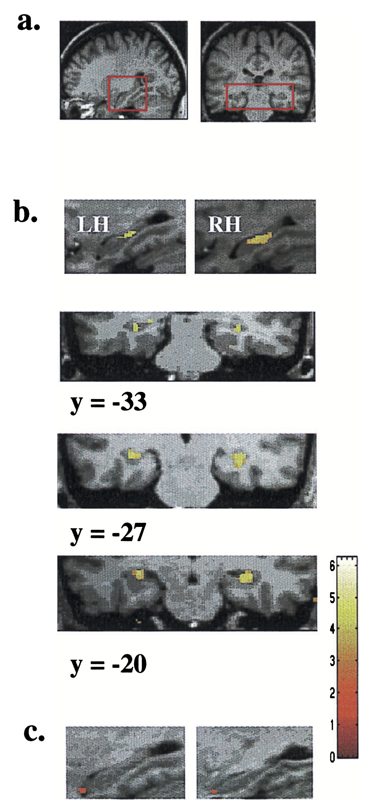
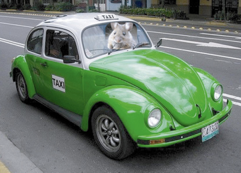
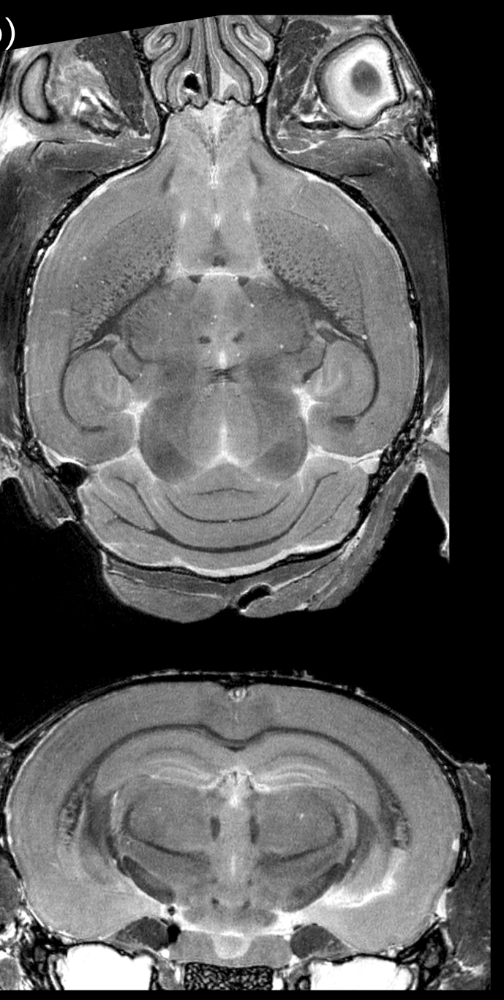
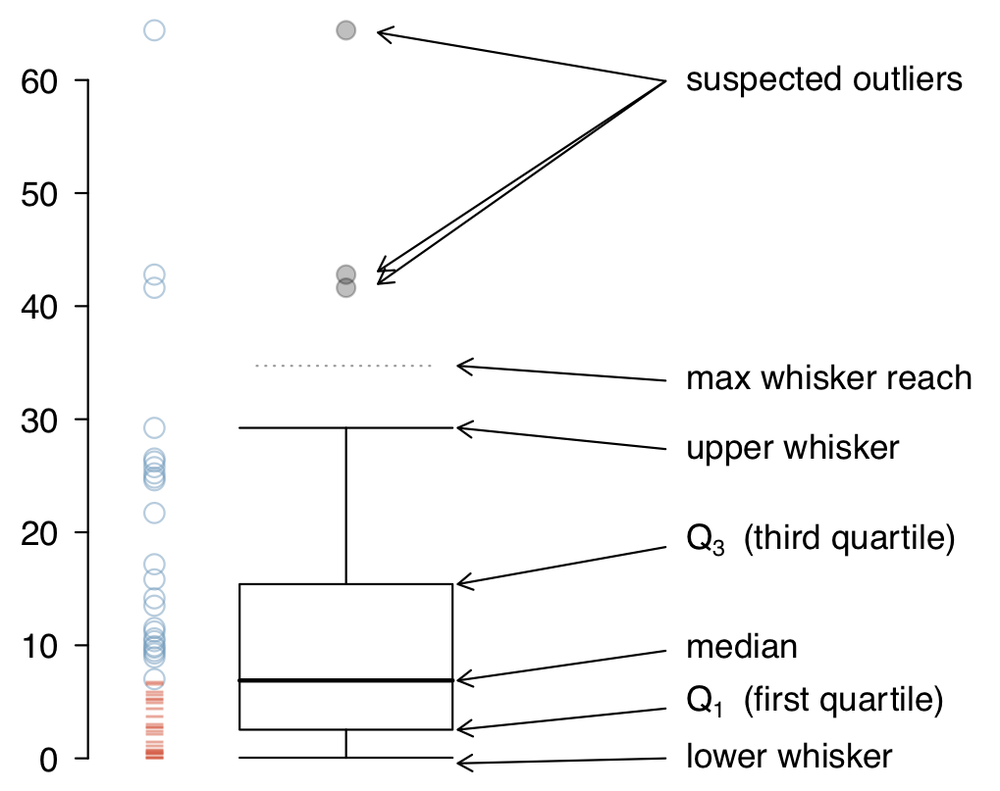
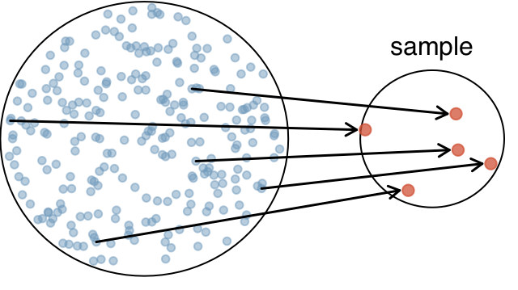
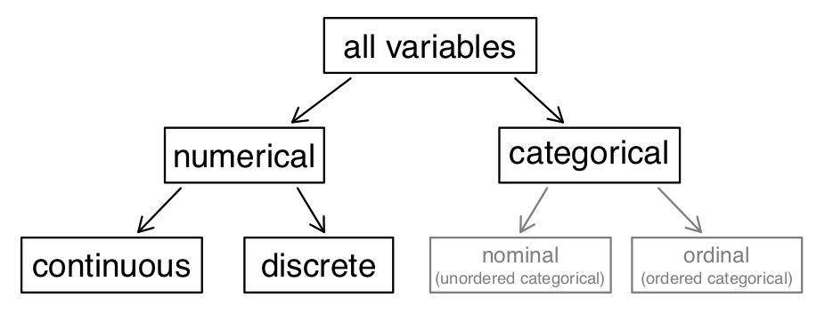
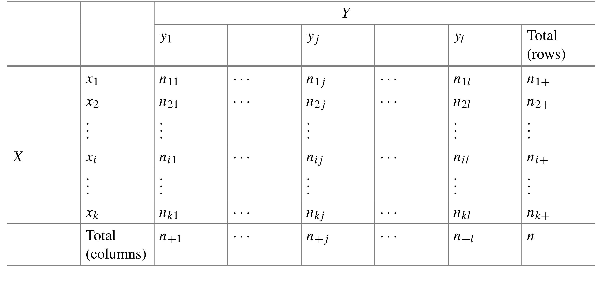

<style>
.small {
  font-size: 65%;
}

.medium {
  font-size: 80%;
}

.smallcode { 

}
.smallcode .remark-code {
  font-size: 50%
}

.footnote {
  font-size: 75%;
  color: gray;
}

</style>

```{r setup, include=FALSE}
options(htmltools.dir.version = FALSE)
```

# Hello World

The three challenges of statistical inference are<sup>1</sup>:

.footnote[
[1] From Andrew Gelman
]

--

1. Generalizing from sample to population

--

2. Generalizing from control to treatment group

--

3. Generalizing from observed measurements to underlying constructs of interest

---

# Three laws of statistics

.pull-left[

Arthur C. Clarke's three laws<sup>1</sup>:

1.  When a distinguished but elderly scientist states that something is possible, he is almost certainly right. When he states that something is impossible, he is very probably wrong.
 
1. The only way of discovering the limits of the possible is to venture a little way past them into the impossible.

1. Any sufficiently advanced technology is indistinguishable from magic.
]

--

.pull-right[

Andrew Gelman's updates<sup>2</sup>:

1. When a distinguished but elderly scientist states that “You have no choice but to accept that the major conclusions of these studies are true,” don’t believe him.

2. The only way of discovering the limits of the reasonable is to venture a little way past them into the unreasonable.

3. Any sufficiently crappy research is indistinguishable from fraud.
]

--

.small[
[1] https://en.wikipedia.org/wiki/Clarke%27s_three_laws

[2] http://andrewgelman.com/2016/06/20/clarkes-law-of-research/
]

---

# The MBP statistics bootcamp

Goals of this week:

1. Teach the theory and practice of statistics

1. Applied data analysis problem solving using R

1. Think hard about truth and replicability in science

Slides, recommended readings, and extra resources here:

https://jasonlerch.github.io/MBP-stats-2019/

(Will try and have slides for each day up the night before)

---

# The MBP statistics bootcamp

```{r, echo=F}
suppressMessages({
  library(huxtable)
  library(tidyverse)
})

ht <- tribble_hux(
  ~ Hour, ~ Monday, ~ Tuesday, ~ Wednesday, ~ Thursday, ~ Friday,
  "9-12", NA, NA, NA, NA, NA,
  "12-3", NA, NA, NA, NA, NA,
#  "1-3",  NA, NA, NA, NA, NA,
#  "3-4",  NA, NA, NA, NA, NA,
  add_colnames = TRUE
) %>%
  set_left_padding(10) %>%
  set_right_padding(10)

bottom_border(ht)[1,] <- 1
right_border(ht)[,1] <- 1

ht[2,2] <- "Introduction. Data organization, descriptive statistics, plotting, basic models. "
ht[3,2] <- "Group assignment #1"
#rowspan(ht)[2, 2] <- 2

ht[2,3] <- "Probability in all its glory. Multiple linear models, interactions, p values. "
ht[3,3] <- "Group assignment #2"
#rowspan(ht)[2,3] <- 2

ht[2,4] <- "Hypothesis testing, searching for truth, multiple comparisons, and the crisis of replicability"
#rowspan(ht)[4,4] <- 2

ht[3,4] <- "Group assignment #3"

ht[2,5] <- "Putting it all together – analyzing a biomedical dataset from beginning to end. Review"
#rowspan(ht)[4,5] <- 2

ht[3,5] <- "Group assignment #4"

ht[2,6] <- "Presentations, exam"

wrap(ht) <- TRUE

escape_contents(ht) <- FALSE

theme_basic(ht)
```

---

# Grading

Exams (concepts only, no R):

```{r, echo=F}

ht <- tribble_hux(
  ~ "What", ~ "When", ~ "How much",
  "Short exam", "Tuesday", "5%",
  "Short exam", "Wednesday", "5%",
  "Short exam", "Thursday", "5%",
  "Final exam", "Friday", "35%",
  add_colnames = TRUE)

theme_basic(ht)


```

Group assignments and presentations (R analyses and concepts):

```{r, echo=F}
ht <- tribble_hux(
  ~ "What", ~ "Due when", ~ "How much",
  "Group assignment #1", "Tuesday", "10%",
  "Group assignment #2", "Wednesday", "10%",
  "Group assignment #3", "Thursday", "10%",
  "Group assignment #4", "Friday", "10%",
  "Final presentation", "Friday", "10%",
  add_colnames = TRUE)

theme_basic(ht)


```

---

# Exams

* true/false, multiple choice, and short paragraphs.

* each class begins with ~ 10 minute, short exam covering previous day.

* final exam 30-60 minutes.

--

.pull-left[
Sample questions:


_Describe the null hypothesis_

_Identify elements of a box and whiskers plot (on a drawing)_

_Discuss analysis pre-registration advantages and disadvantages_

_TRUE/FALSE: if you compute a 95% confidence interval, you have a 95% chance of it containing the true value_
]

.pull-right[

```{r, echo=FALSE}

ggplot(data.frame(sample=rnorm(10000))) + 
  aes(y=sample) + 
  geom_boxplot() + 
  xlab("") + 
  ylab("") +
  scale_x_continuous(breaks = NULL) + 
  scale_y_continuous(breaks = NULL) +
  theme_classic()

```


]


---

# Group assignments

* split into small groups of 3-4.

* we will assign groups.

* will try to mix groups by R and programming expertise.

* each group will be graded as a unit.

* final presentation given by a member of the group with least R/programming expertise.

---

class: inverse, center, middle

# Let's get started

---

# Statistical software

.pull-left[

Common software

1. Excel

1. SPSS

1. SAS

1. matlab

1. python

1. R
]

--

.pull-right[

Ups and downs of R

1. Open source, free, and powerful.

1. If a statistical test exists, it likely exists in R.

1. Literate programming/self documenting analyses.

1. Very strong in bioinformatics.

1. Steeper learning curve.
]


---

class: inverse, middle, center

# Reading and summarizing our data

---

# Intro to our dataset

.pull-left[

How do our brains change as we learn or undergo new experiences?

Earliest evidence that our brains are _plastic_ at larger, or _mesoscopic_, scales came from a study of taxi drivers in London, UK.

Mechanism of how that happens is unclear.

]

.pull-right[



]

.footnote[PhD Thesis of Dulcie Vousden]

---

# Mouse models

.pull-left[

We can create taxi driving mice.

Use high-field MRI to get similar readout as in humans.

Use genetic models to test hypotheses of implicated pathways.

Use RNA sequencing to assess what changes per genotype or experimental group.



]

.pull-right[



]

---

# The dataset

```{r, include=FALSE}
#mice <- readRDS("mice.Rds")
mice <- read.csv("mice.csv")
volumes <- read.csv("volumes.csv", check.names = F)

mice <- mice %>% inner_join(volumes)
```

--

There are `r length(unique(mice$ID))` mice in this dataset, with MRI scans acquired at `r length(unique(mice$Timepoint))` timepoints.

--

We have 3 genotypes: `r levels(mice$Genotype)`

--

There are 4 environmental conditions: `r levels(mice$Condition)`

--

MRIs were acquired at every timepoint, and the brains automatically segmented into `r ncol(mice$vols_combined)` regions.

--

There are good reasons to believe that the hippocampus and the dentate gyrus of the hippocampus will be the most affected by the environmental interventions.

--

The effect of the three genotypes alone is interesting.


---

# Enrichment

<video src="images/enrichment.mov" controls loop>


---

# Reading data

A surprising amount of time in data analysis is spent in prepping data for visualization and analysis.

```{r}
library(tidyverse)
library(forcats)

mice <- read_csv("mice.csv")

```

---
# Meet the mice

```{r}
str(mice, give.attr=FALSE)
```

---

# Numeric variable: age

```{r}
mice %>%
  summarise(mean=mean(Age),
            min=min(Age),
            max=max(Age))
```


---

# Factors: Sex, Condition, Genotype

.pull-left[

```{r}
mice %>%
  group_by(Sex) %>%
  summarise(n=n())
```
]


.pull-right[
```{r}
mice %>% 
  group_by(Genotype) %>% 
  summarize(n=n())
```
]
---

# Subject descriptors: ID and Timepoint

```{r}
mice %>%
  select(ID, Timepoint) %>%
  head
```

---

# Alternate encodings: Genotype

```{r}
mice %>%
  select(Genotype, Mouse.Genotyping) %>%
  head
```

---

# Alternate encodings: Days of EE, DaysofEE0

```{r}
mice %>%
  filter(ID == 901) %>%
  select(Timepoint, DaysOfEE, DaysOfEE0) %>%
  head
```

---

# Overview of subject numbers

```{r}
with(mice,
     ftable(Condition, Genotype, Timepoint))
```

---

# Factors, revisited

The Timepoint order makes no sense. Let's reorder

```{r}
mice <- mice %>%
  mutate(Timepoint=fct_relevel(Timepoint, "Pre1", "Pre2", "24h", 
                               "48h", "1 week", "2 week"))
with(mice, ftable(Condition, Genotype, Timepoint))
```

---

# Redo in tidyverse

```{r}
mice %>% 
  group_by(Condition, Genotype, Timepoint) %>% 
  summarise(n=n()) %>% spread(Timepoint, value=n)
```


---

# Reading more data


```{r}
volumes <- read_csv("volumes.csv")
```

---

# Inspecting the new data

```{r}
str(volumes)
```


---

# Linking data

.pull-left[

```{r}
volumes %>%
  select(ID, Timepoint) %>%
  head
```

]

.pull-right[

```{r}
mice %>%
  select(ID, Timepoint) %>%
  head
```


]
---

# Joining data

```{r}

mice <- mice %>% 
  inner_join(volumes) 

str(mice)
```


---

class: inverse, middle, center

# Data visualization

---

# Data visualization

Data visualization communicates your data to your audience - and can be how your data communicates with you.

--

Excellent guide to visualization:

https://www.data-to-viz.com

--

Your task for later will be to look at the interesting variables in this dataset. For now, we will look at sex and the brain instead.

---

# Histogram

```{r, fig.height=5, fig.width=12}
ggplot(mice) + 
  aes(x=`bed nucleus of stria terminalis`) + 
  geom_histogram() 
```

---

# Make it prettier

```{r, fig.height=4.5, fig.width=12}
ggplot(mice) + 
  aes(x=`bed nucleus of stria terminalis`) + 
  geom_histogram() +
  xlab(bquote(Volume ~ (mm^3))) + #<<
  ggtitle("Bed nucleus of stria terminalis") +  #<<
  theme_gray(16) #<<
```

---

# Histogram bins

```{r, fig.height=5, fig.width=12}
ggplot(mice) + 
  aes(x=`bed nucleus of stria terminalis`) + 
  geom_histogram(binwidth = 0.01) + #<<
  xlab(bquote(Volume ~ (mm^3))) + 
  ggtitle("Bed nucleus of stria terminalis") +  
  theme_gray(16) 
```

---

# Facets

```{r facets, fig.height=5, fig.width=12}
ggplot(mice) + 
  aes(x=`bed nucleus of stria terminalis`) + 
  geom_histogram(binwidth = 0.01) +
  xlab(bquote(Volume ~ (mm^3))) + 
  ggtitle("Bed nucleus of stria terminalis") +  
  theme_gray(16) +
  facet_grid(Sex ~ .) #<<
```

---

# Colours

```{r colours, fig.height=5, fig.width=12}
ggplot(mice) + 
  aes(x=`bed nucleus of stria terminalis`, fill=Sex) + #<<
  geom_histogram(binwidth = 0.01) +
  xlab(bquote(Volume ~ (mm^3))) + 
  ggtitle("Bed nucleus of stria terminalis") +  
  theme_gray(16)
```

---


`)

`)

---

# Points


```{r, fig.height=5, fig.width=12}
ggplot(mice) + 
  aes(x=Sex, y=`bed nucleus of stria terminalis`) +
  geom_point() + 
  ggtitle("Bed nucleus of stria terminalis",
          subtitle="Across all timepoints and genotypes") + 
  ylab(bquote(Volume ~ (mm^3))) + 
  theme_classic(16) 
```

???

* Point out changed aes
* Point out subtitle

---

# Points

That's not very useful - too many points to see separation.

```{r, fig.height=4, fig.width=12}
ggplot(mice) + 
  aes(x=Sex, y=`bed nucleus of stria terminalis`) +
  geom_jitter() + #<<
  ggtitle("Bed nucleus of stria terminalis",
          subtitle="Across all timepoints and genotypes") +
  ylab(bquote(Volume ~ (mm^3))) + 
  theme_classic(16)
```

---

# Boxplot

Good view of data distribution

```{r, fig.height=4.5, fig.width=12}
ggplot(mice) + 
  aes(x=Sex, y=`bed nucleus of stria terminalis`) +
  geom_boxplot() + 
  ggtitle("Bed nucleus of stria terminalis",
          subtitle="Across all timepoints and genotypes") +
  ylab(bquote(Volume ~ (mm^3))) + 
  theme_classic(16)
```

---



---

# Ridge lines

```{r, fig.height=4.3, fig.width=12}
suppressMessages(library(ggridges))
ggplot(mice) + 
  aes(y=Sex, x=`bed nucleus of stria terminalis`) +
  geom_density_ridges() + 
  ggtitle("Bed nucleus of stria terminalis",
          subtitle="Across all timepoints and genotypes") +
  xlab(bquote(Volume ~ (mm^3))) + 
  theme_classic(16)
```


---

# Violins

```{r, fig.height=4.5, fig.width=12}
ggplot(mice) + 
  aes(x=Sex, y=`bed nucleus of stria terminalis`) +
  geom_violin() + 
  ggtitle("Bed nucleus of stria terminalis",
          subtitle="Across all timepoints and genotypes") +
  ylab(bquote(Volume ~ (mm^3))) + 
  theme_classic(16)
```


---
class: smallcode

# Combining plot types

<!-- Code is cut off in rendered slide -->


.pull-left[
```{r c1, fig.show='hide'}
ggplot(mice) + 
  aes(x=Sex, 
      y=`bed nucleus of stria terminalis`
      ) +
  geom_boxplot() +
  geom_jitter(width=0.2, 
              alpha=0.2) +  
  ggtitle("Bed nucleus of stria terminalis",
          subtitle="Across all timepoints and genotypes") +
  ylab(bquote(
    Volume ~ (mm^3))) + 
  theme_classic(16)
```
]

.pull-right[

`)

]

---

# Adding colour

```{r c2, fig.show='hide', fig.width=12}
ggplot(mice) + 
  aes(x=Sex, 
      y=`bed nucleus of stria terminalis`,
      colour=Sex) +
  geom_boxplot() +
  geom_jitter(width=0.2, 
              alpha=0.2) +  
  ggtitle("Bed nucleus of stria terminalis",
          subtitle="Across all timepoints and genotypes") +
  ylab(bquote(
    Volume ~ (mm^3))) + 
  theme_classic(16)
```

---

# Adding colour


`)

---

# Using colour for additional information

```{r c3, fig.width=12, fig.show='hide'}
ggplot(mice) + 
  aes(x=Sex, 
      y=`bed nucleus of stria terminalis`,
      colour=Timepoint) +
  geom_boxplot() +
  geom_jitter(alpha=0.2,
              position = position_jitterdodge(jitter.width = 0.2)) +  
  ggtitle("Bed nucleus of stria terminalis",
          subtitle="Across all genotypes") +
  ylab(bquote(Volume ~ (mm^3))) + 
  theme_classic(16)
```

---

# Using colour for additional information

`)

---

# Using colour for additional information

```{r c4, fig.width=12, fig.show='hide'}
ggplot(mice) + 
  aes(x=Sex, 
      y=`bed nucleus of stria terminalis`,
      colour=Timepoint) +
  geom_boxplot() +
  geom_jitter(alpha=0.2,
              position = position_jitterdodge(jitter.width = 0.2)) +  
  ggtitle("Bed nucleus of stria terminalis",
          subtitle="Across all genotypes") +
  ylab(bquote(Volume ~ (mm^3))) + 
  scale_colour_viridis_d(option="C", end=0.8) + 
  theme_classic(16)
```

---

# Using colour for additional information

`)

---

# Factor order, again

Apparently the factor ordering was lost in data joining?

```{r c5, fig.width=12, fig.show='hide'}
mice <- mice %>%
  mutate(Timepoint=fct_relevel(Timepoint, "Pre1", "Pre2", "24h", 
                               "48h", "1 week", "2 week"))

ggplot(mice) + 
  aes(x=Sex, 
      y=`bed nucleus of stria terminalis`,
      colour=Timepoint) +
  geom_boxplot() +
  geom_jitter(alpha=0.2,
              position = position_jitterdodge(jitter.width = 0.2)) +  
  ggtitle("Bed nucleus of stria terminalis",
          subtitle="Across all genotypes") +
  ylab(bquote(Volume ~ (mm^3))) + 
  scale_colour_viridis_d(option="C", end=0.8) +
  theme_classic(16)
```

---

# Factor ordering, again

`)

---

# Better encoding of time

```{r t1, fig.width=12, fig.show='hide'}

ggplot(mice) + 
  aes(x=DaysOfEE,
      y=`bed nucleus of stria terminalis`,
      colour=Sex) +
  geom_boxplot(aes(group=interaction(Timepoint, Sex))) + 
  geom_jitter(alpha=0.25, position = 
                position_jitterdodge(jitter.width = 0.2)) + 
  ylab(bquote(Volume ~ (mm^3))) + 
  xlab("Days of enrichment") + 
  ggtitle("Bed nucleus of stria terminalis",
          subtitle = "Change over time") + 
  theme_classic(16)

```


---

# Better encoding of time

`)

---

# Combining colours and facets

```{r t2, fig.width=12, fig.show='hide'}

ggplot(mice) + 
  aes(x=DaysOfEE,
      y=`bed nucleus of stria terminalis`,
      colour=Sex) +
  geom_boxplot(aes(group=interaction(Timepoint, Sex))) + 
  geom_jitter(alpha=0.25, position = 
                position_jitterdodge(jitter.width = 0.2)) + 
  ylab(bquote(Volume ~ (mm^3))) + 
  xlab("Days of enrichment") + 
  ggtitle("Bed nucleus of stria terminalis",
          subtitle = "Change over time") + 
  facet_grid(Genotype ~ .) + #<<
  theme_classic(16)

```


---

# Combining colours and facets

`)

---

# Adding lines

```{r t3, fig.width=12, fig.show='hide'}

ggplot(mice) + 
  aes(x=DaysOfEE,
      y=`bed nucleus of stria terminalis`,
      colour=Sex) +
  geom_boxplot(aes(group=interaction(Timepoint, Sex))) + 
  geom_jitter(alpha=0.25, position = 
                position_jitterdodge(jitter.width = 0.2)) + 
  stat_summary(fun.y = median, geom="line", #<<
               position = #<<
                 position_jitterdodge(jitter.width = 0.2)) + #<<
  ylab(bquote(Volume ~ (mm^3))) + 
  xlab("Days of enrichment") + 
  ggtitle("Bed nucleus of stria terminalis",
          subtitle = "Change over time") + 
  facet_grid(Genotype ~ .) +
  theme_classic(16)

```

---

# Adding lines

`)

---

class: inverse, center, middle

# Descriptive statistics

---

# Descriptive statistics

summarize datapoints into measures of

* central tendency

  * mean/average: $\bar{x} = \frac{1}{n} \sum_{i=1}^n x_i$
  
  * median: sort numbers, pick middle
  
  * mode: most common number

* variance/dispersion

  * standard deviation: $\sigma = \sqrt{\frac{1}{n-1} \sum_{i=1}^n (x_i - \bar{x})^2}$
  
  * range: smallest to largest value
  
  * interquartile range: recursive median calculations (median of upper half, median of lower half)


---

# Plotting mean and standard deviation

```{r t4, fig.width=12, fig.show='hide'}
suppressMessages(library(Hmisc))

p <- position_jitterdodge(jitter.width = 0.2)

ggplot(mice) + 
  aes(x=DaysOfEE,
      y=`bed nucleus of stria terminalis`,
      colour=Sex) +
  stat_summary(fun.data=mean_sdl, geom="pointrange", size=1,  #<<
               shape=17, fun.args=(mult=1), position=p) + #<<
  geom_jitter(alpha=0.15, position = p) + 
  stat_summary(fun.y = median, geom="line", 
               position =p) +
  ylab(bquote(Volume ~ (mm^3))) + 
  xlab("Days of enrichment") + 
  ggtitle("Bed nucleus of stria terminalis",
          subtitle = "Change over time") + 
  facet_grid(Genotype ~ .) +
  theme_classic(16)

```

---

# Plotting mean and standard deviation

`)

---

# Standard error of the mean

Standard deviations independent of sample size. Statistical tests usually take sample size into account. The standard error of the mean is the standard deviation divided by the square root of n.

$$\sigma = \sqrt{\frac{1}{n-1} \sum_{i=1}^n (x_i - \bar{x})^2}$$
$$\sigma_{\bar{x}} = \frac{\sigma}{\sqrt{n}}$$

---

# Plotting mean and standard error

```{r t5, fig.width=12, fig.show='hide'}
suppressMessages(library(Hmisc))

p <- position_jitterdodge(jitter.width = 0.2)

ggplot(mice) + 
  aes(x=DaysOfEE,
      y=`bed nucleus of stria terminalis`,
      colour=Sex) +
  stat_summary(fun.data=mean_se, geom="pointrange",  #<<
              fun.args=(mult=1), position=p) + #<<
  geom_jitter(alpha=0.15, position = p) + 
  stat_summary(fun.y = median, geom="line", 
               position =p) +
  ylab(bquote(Volume ~ (mm^3))) + 
  xlab("Days of enrichment") + 
  ggtitle("Bed nucleus of stria terminalis",
          subtitle = "Change over time") + 
  facet_grid(Genotype ~ .) +
  theme_classic(16)

```

---

# Plotting mean and standard error

`)


---

# Summary table

```{r, results='asis'}
mice %>%
  group_by(Genotype, Sex, DaysOfEE) %>%
  summarise(m=mean(`bed nucleus of stria terminalis`)) %>%
  spread(DaysOfEE, m)  %>%
  knitr::kable(format = 'html')
```

---

# Summary table

```{r, results='asis'}
mice %>%
  group_by(Genotype, Sex, DaysOfEE) %>%
  summarise(m=paste(round(mean(`bed nucleus of stria terminalis`),2),
                    round(sd(`bed nucleus of stria terminalis`), 2), sep="±")) %>%
  spread(DaysOfEE, m) %>%
  knitr::kable(format = 'html')
```

---

class: inverse, center, middle

# Statistical tests

---

# From populations to samples



.footnote[
OpenIntro Statistics, Diez, Barr, and Cetinkaya-Rundel, 2015
]

???

Talk about sources of bias

---

# Data types



Data types determine choice of statistics and/or encoding.

.footnote[
OpenIntro Statistics, Diez, Barr, and Cetinkaya-Rundel, 2015
]

---

# Sex ratios

Are the sex ratios in our data balanced?

```{r}
baseline <- mice %>% filter(Timepoint == "Pre1")
addmargins(with(baseline, table(Sex)))
```

--

What should we expect?

Assume equal probability of male or female

```{r}
nrow(baseline) / 2
```

---

# How likely was our real value?

Binomial distribution - flip of a coin.

```{r}
rbinom(1, 1, 0.5)
rbinom(1, 1, 0.5)
rbinom(1, 1, 0.5)
rbinom(10, 1, 0.5)
```


---

# How likely was our real value?

```{r}
baseline <- mice %>% filter(Timepoint == "Pre1")
addmargins(with(baseline, table(Sex)))

```

Assuming random choice of male or female:

```{r}
distribution <- rbinom(266, 1, 0.5)
sum(distribution==1)
```

--

```{r}
rbinom(1, 266, 0.5)
```

???

Get everyone in class to run it and get some answers

---

# Long run probability

We did a single experiment, and obtained 101 Females and 165 Males.

If we were to rerun the experiment again and again and again, and each experimental mouse had a 50/50 chance of being male or female, how often would we obtain 101 Females or fewer?

--

```{r}
nexperiments <- 1000 
females <- vector(length=nexperiments)
for (i in 1:nexperiments) {
  females[i] <- rbinom(1, 266, 0.5)
}
head(females)

```

--

Can be shortened as

```{r}
females2 <- rbinom(nexperiments, 266, 0.5)
head(females2)
```


---

# Long run probability

```{r, fig.width=12, fig.height=4}
head(females)

ggplot(data.frame(females=females)) +
  aes(x=females) + 
  geom_histogram(binwidth = 3) + 
  theme_minimal(16)
```
---

# Long run probability

```{r, fig.width=12, fig.height=4}
ggplot(data.frame(females=females)) +
  aes(x=females) + 
  geom_histogram(binwidth = 3) + 
  theme_minimal(16)

sum(females<=101)
```

---

# Closed form solution
```{r, fig.width=12, fig.height=4}
ggplot() +
  geom_histogram(data=data.frame(females=females),
                 aes(x=females, y=..density..),
                 binwidth = 3) + 
  geom_bar(aes(c(100:160)), stat="function", 
           fun=function(x) dbinom(round(x), 266, 0.5), #<<
           alpha=0.5, fill="blue") +
  theme_minimal(16)
```

---

# Closed form solution

```{r}
pbinom(101, 266, 0.5)
```

--

```{r}
sum(dbinom(0:101, 266, 0.5))
```

--

.pull-left[
```{r, echo=F, fig.height=5}
ggplot() + 
  aes(c(100,175)) + 
  geom_area(stat="function", 
           fun=function(x) dbinom(round(x), 266, 0.5), #<<
           alpha=0.5, fill="blue") +
  xlab("# Females out of 266") + 
  ylab("p") + 
  ggtitle("PDF", subtitle = "Probability Density Function") +
  theme_minimal(16)
```

]

.pull-right[
```{r, echo=F, fig.height=5}
ggplot() + 
  aes(c(100,175)) + 
  geom_area(stat="function", 
           fun=function(x) pbinom(round(x), 266, 0.5), #<<
           alpha=0.5, fill="blue") +
  xlab("# Females out of 266") + 
  ylab("p") + 
  ggtitle("CDF", subtitle = "Cumulative Density Function") +
  theme_minimal(16)
```
]

---

# Review

* We asked whether the sex ratio in the study was likely to be random, assuming an equal chance of an experimental mouse being male or female.

--

* We simulated 1000 studies under the assumption of n=266 and the odds of being female = 50%

--

* This is the null hypothesis.

--

* Our random data simulations test the null hypothesis: what would happen if we ran the experiment again and again and again under the same conditions assuming random assignment of males and females?

--

* Our p-value - the long run probability under repeated experiments - was vanishingly small.

--

So the choice of sex was almost certainly non-random. Does it matter?

---

# Contingency table

```{r}
baseline <- mice %>% filter(Timepoint == "Pre1")
with(baseline, table(Sex, Genotype))
addmargins(with(baseline, table(Sex, Genotype)))

```

---
# What would we expect?

The table of observed numbers

```{r}
addmargins(with(baseline, table(Sex, Genotype))) %>% 
  knitr::kable(format = 'html')
```

--

Calculating the expected numbers

|    | CREB -/- | CRE +/- | CREB +/+ | Sum |
|----|----------|---------|----------|-----|
|F   |82*101/266|90*101/266|94*101/266|101|
|M   |82*165/266|90*165/266|94*165/266|165|
|Sum |82        |90        |94        |266


---


# Using the chisq.test function for these calculations

```{r}
xtest <- with(baseline, chisq.test(Sex, Genotype))
addmargins(xtest$observed)
addmargins(xtest$expected)

```

---

# $\chi^2$ test

$$\chi^2 = \sum^k_{i=1} \sum^l_{j=1} \frac{n_{ij} - \tilde{n}_{ij}}{\tilde{n}_{ij}} = \sum^k_{i=1} \sum^l_{j=1} \frac{(n_{ij} - \frac{n_i + n + j}{n})^2}{\frac{n_i + n + j}{n}}$$



--

```
sum( ((xtest$observed - xtest$expected)^2)/xtest$expected )
```

---

# $\chi^2$ test

```{r}
sum( ((xtest$observed - xtest$expected)^2)/xtest$expected )
```

--

Put that number into context?

```{r, echo=FALSE, fig.height=5, fig.width=12}
ggplot() + 
  aes(c(0,8)) + 
  geom_area(stat="function", fun=function(x) pchisq(x, 2, lower.tail = F), xlim=c(0,8), fill="light gray", alpha=0.5) + 
  geom_area(stat="function", fun=function(x) pchisq(x, 2, lower.tail = F), xlim=c(xtest$statistic, 8), alpha=0.5) +
  xlab(bquote(chi^2)) + 
  ylab("p") + 
  annotate("text", x=1, y=0.1, label=paste(round(pchisq(xtest$statistic, 2), 3), "this side")) + 
  annotate("text", x=3, y=0.1, label=paste(round(pchisq(xtest$statistic, 2, lower.tail = F), 3), "this side"))  +
  theme_minimal(20)

```

---

# $\chi^2$ test

```{r}
with(baseline, chisq.test(Sex, Genotype))
```


---

# Review

.medium[


* We asked whether the sex ratio in the study was likely to be random, assuming an equal chance of an experimental mouse being male or female.

* We simulated 1000 studies under the assumption of n=266 and the odds of being female = 50%

* This is the null hypothesis.

* Our random data simulations test the null hypothesis: what would happen if we ran the experiment again and again and again under the same conditions assuming random assignment of males and females?

* Our p-value - the long run probability under repeated experiments - was vanishingly small.

So the choice of sex was almost certainly non-random. Did it matter?

* Chi-squared test to assess contingency tables.

* test outcome against known distribution

* the sex bias was shared by all genotypes - p value indicated this could easily have occurred by random chance.
]

---

class: inverse, center, middle

# Literate programming

---

# Literate programming

.pull-left[

### The Idea:

* mix code, text, and figures in one document.

* All analyses and their outputs remain in sync

* Can work as a notebook

]

--

.pull-right[

### The Implementation:

* rmarkdown
    * simple markup language for text
    * code embedded in document
    * documents are compiled - or knitted - to produce output html or pdf
    
* Great alternative: Jupyter
]

---

class: inverse, center, middle

# Assignment

---

# Group assignment number 1

.medium[

1. Assemble into your assigned teams.

1. Ensure that RStudio is running and you can load all required libraries.

1. Load the required data

1. Create an rmarkdown document that contains the following:

    1. A summary table of the subject numbers per timepoint, genotype, and condition
  
    1. Visualization(s) of the difference in hippocampal volume by Genotype at the final timepoint.
  
    1. Visualization(s) of the difference in hippocampal volume by Condition at the final timepoint.
  
    1. Visualization(s) of the change over time by Condition and Genotype.
  
1. Make sure that all team members are listed as authors.

1. Any questions: ask here in person, or email us (jason.lerch@ndcn.ox.ac.uk, mehran.karimzadehreghbati@mail.utoronto.ca) and we promise to answer quickly.

]