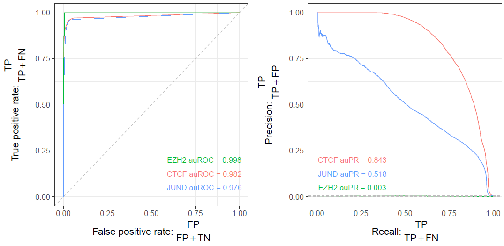

<style>
.small {
  font-size: 65%;
}

.medlarge {
  font-size: 95%;
}

.medium {
  font-size: 80%;
}

.footnote {
  font-size: 75%;
  color: gray;
}

.smallcode { 

}
.smallcode .remark-code {
  font-size: 50%
}

.smallercode { 

}
.smallercode .remark-code {
  font-size: 75%
}

</style>

```{r setup, include=FALSE}
options(htmltools.dir.version = FALSE)
```

# Hello World

Today is about truth and replication, multiple comparisons, and effect sizes and statistical power.


---

class: inverse, center, middle

# Why most published research findings are false

---

# The probability that a research finding is true depends on the prior probability of it being true

This calls for a digression into Bayes theorem

---

class: center
# Meet The Reverend

Reverend Thomas Bayes


---
class: middle

## Bayes' Theorem

- Bayes noticed this useful property for the probabilities for two events "A" and "B"

$$ \color{red}{P(A | B)} = \frac{{\color{blue}{P(B | A)}\color{orange}{P(A)}}}{\color{magenta}{P(B)}} $$


- $\color{red}{P(A|B)}$: The probability of A given that B happened
- $\color{blue}{P(B|A)}$: The probability of B given that A happened
- $\color{orange}{P(A)}$: The probability of A
- $\color{magenta}{P(B)}$: the probability of B

- Bayes did this in the context of the binomial distribution

---

# Bayes' theorem in action

Disease prevalence = 1/1000

--

diagnostic test: 99% hit rate (i.e. if person has the disease, test will be positive 99% of the time)

--

diagnostic test: 5% false positive rate (i.e. if person does not have the disease, test will be positive 5% of the time)

--

.pull-left[
$\theta = 1$ disease is present

$\theta = 0$ disease is absent

$T = +$ test is positive

$T = -$ test is negative
]

.pull-right[
sample a random person from the street, administer the test, it comes up positive. What is the probability that this person has the disease?
]

---

# Bayes' theorem in action

Disease prevalence = 1/1000

diagnostic test: 99% hit rate (i.e. if person has the disease, test will be positive 99% of the time)

diagnostic test: 5% false positive rate (i.e. if person does not have the disease, test will be positive 5% of the time)

.pull-left[
$p(\theta = 1) = 0.001$ disease is present

$p(\theta = 0) = 0.999$ disease is absent

$T = +$ test is positive

$T = -$ test is negative
]

.pull-right[
sample a random person from the street, administer the test, it comes up positive. What is the probability that this person has the disease?
]

---

# Bayes' theorem in action


.pull-left[
$p(\theta = 1) = 0.001$ disease is present

$p(\theta = 0) = 0.999$ disease is absent

$T = +$ test is positive

$T = -$ test is negative
]

.pull-right[
sample a random person from the street, administer the test, it comes up positive. What is the probability that this person has the disease?
]

---

# Bayes' theorem in action


--

$$ \color{red}{P(A | B)} = \frac{{\color{blue}{P(B | A)}\color{orange}{P(A)}}}{\color{magenta}{P(B)}} $$

--

$$ \color{red}{P(\theta=1 | T = +)} = \frac{{\color{blue}{P(T = + | \theta=1)}\color{orange}{P(\theta=1)}}}{\color{magenta}{\sum_\theta P(T = + | \theta)p(\theta)}} $$
--

$$ \color{red}{P(\theta=1 | T = +)} = \frac{{\color{blue}{0.99} \times\color{orange}{0.001}}}{\color{magenta}{0.99 \times 0.001 + 0.05 \times (1-0.001)}} = 0.019 $$

---

# Bayes' theorem in action

Disease prevalence = 1/1000

diagnostic test: 99% hit rate (i.e. if person has the disease, test will be positive 99% of the time)

diagnostic test: 5% false positive rate (i.e. if person does not have the disease, test will be positive 5% of the time)

$$ \color{red}{P(A | B)} = \frac{{\color{blue}{P(B | A)}\color{orange}{P(A)}}}{\color{magenta}{P(B)}} $$


$$ \color{red}{P(\theta=1 | T = +)} = \frac{{\color{blue}{P(T = + | \theta=1)}\color{orange}{P(\theta=1)}}}{\color{magenta}{\sum_\theta P(T = + | \theta)p(\theta)}} $$


$$ \color{red}{P(\theta=1 | T = +)} = \frac{{\color{blue}{0.99} \times\color{orange}{0.001}}}{\color{magenta}{0.99 \times 0.001 + 0.05 \times (1-0.001)}} = 0.019 $$


---

## The probability that a research finding is true depends on the prior probability of it being true


R = ratio of the number of "true relationships" to "no relationships" among those tested in the field.

$R / (R+1)$ = pre-study probability of a relationship being true

$1 - \beta$ = probability of a study finding a true relationship (power)

$\alpha$ = probability of claiming a true relationship where none exists (p-value)


---

class: smallercode

## Statistical power via simulations

```{r}
simFakeData <- function(intercept=100, # what happens at age 20 in G1 M
                        sex_at_20=3,   # how F differs from M at age 20
                        G2_at_20=0,    # how G2 differs from G1 at age 20
                        G3_at_20=0,    # how G3 differs from G1 at age 20
                        delta_year=0.5,# change per y for G1 M
                        sex_year=0,    # additional change per y For F
                        G2_year=0,     # additional change per y for G2
                        G3_year=0,     # additional change per y for G3
                        noise=2,       # Gaussian noise
                        n_per_group = 40) { # subjects/each of the 3 groups
  age <- runif(n_per_group*3, min=20, max=80) # randomly select ages 
  group <- c( # create the group labels
    rep("G1", n_per_group),
    rep("G2", n_per_group),
    rep("G3", n_per_group)) # next line: half of each group is male
  sex <- c(rep(rep(c("M", "F"), each=ceiling(n_per_group/2)), 3))
  
  outcome <- intercept + 
    ifelse(sex == "F", sex_at_20, 0) + 
    ifelse(group == "G2", G2_at_20, 0) +
    ifelse(group == "G3", G3_at_20, 0) +
    (age-20)*delta_year + 
    ifelse(sex == "F", (age-20)*sex_year, 0) + 
    ifelse(group == "G2", (age-20)*G2_year, 0) +
    ifelse(group == "G3", (age-20)*G3_year, 0) +
    rnorm(length(age), mean=0, sd=noise)
  return(data.frame(age, sex, group, outcome))
}

```

---

# Simple group comparison: sex

```{r, fig.height=4, fig.width=12}
library(ggplot2)
library(broom)
suppressMessages(library(tidyverse))

fake <- simFakeData(sex_at_20 = 3, delta_year = 0)

lm(outcome ~ sex, fake) %>% tidy
```

---

# Simple group comparison, sex

```{r, fig.height=4, fig.width=12}
ggplot(fake) + aes(sex, outcome) +
  geom_boxplot()
```

---

# Now assume no group difference

```{r, fig.height=4, fig.width=12}
fake <- simFakeData(sex_at_20 = 0, delta_year = 0)
ggplot(fake) + aes(sex, outcome) +
  geom_boxplot()
```

---

# Keep the output

```{r}
tidy(lm(outcome ~ sex, fake))$p.value[2]
```

---

# And repeat for multiple simulations

```{r}
nsims <- 1000
pvals <- vector(length=nsims) # keep the p values
for (i in 1:nsims) {
  # for every simulation, compute the linear model and keep p value
  pvals[i] <- tidy(lm(outcome ~ sex, 
      simFakeData(sex_at_20 = 0, delta_year = 0)))$p.value[2]
}
```

What number of those p values will be < 0.05?

---

# Alpha level - Type I error rate

```{r, fig.height=3, fig.width=12}
sum(pvals < 0.05)
qplot(pvals, breaks=seq(0.0, 0.95, by=0.05))
```

---

# Statistical power

$\alpha$ or p-value threshold are only dependent on null hypothesis

Statistical power - ability to detect true differences - are additionally dependent on:

* effect size

* sample size

* noise/variance

---
class: smallercode

# Statistical power - effect size

Keep everything but effect size constant

```{r}
effects <- seq(0, 2, by=0.2)
rejections <- effects

nsims <- 500

for (i in 1:length(effects)) {
  pvals <- vector(length=nsims) # keep the p values
  for (j in 1:nsims) {
    # for every simulation, compute the linear model and keep p value
    pvals[j] <- tidy(lm(outcome ~ sex, 
                        simFakeData(sex_at_20 = effects[i], # vary effect
                                    noise=2, # keep noise constant
                                    n_per_group = 40, # keep n constant
                                    delta_year = 0)))$p.value[2]
  }
  rejections[i] <- mean(pvals < 0.05) # keep alpha at 0.05
}
```


---

# Statistical power - effect size

```{r, fig.height=4, fig.width=12}
qplot(effects, rejections, geom=c("point", "line"))
```


---
class: smallercode

# Statistical power - noise

Keep everything but noise  constant

```{r}
noise <- seq(0.1, 3, by=0.3)
rejections <- noise

nsims <- 500

for (i in 1:length(noise)) {
  pvals <- vector(length=nsims) # keep the p values
  for (j in 1:nsims) {
    # for every simulation, compute the linear model and keep p value
    pvals[j] <- tidy(lm(outcome ~ sex, 
                        simFakeData(sex_at_20 = 0.5, # effect constant
                                    noise=noise[i], # keep noise constant
                                    n_per_group = 40, # keep n constant
                                    delta_year = 0)))$p.value[2]
  }
  rejections[i] <- mean(pvals < 0.05) # keep alpha at 0.05
}
```


---

# Statistical power -  noise

```{r, fig.height=4, fig.width=12}
qplot(noise, rejections, geom=c("point", "line"))
```

---
class: smallercode

# Statistical power - group size

Keep everything but noise  constant

```{r}
npg <- seq(4, 100, by=8)
rejections <- npg

nsims <- 500

for (i in 1:length(npg)) {
  pvals <- vector(length=nsims) # keep the p values
  for (j in 1:nsims) {
    # for every simulation, compute the linear model and keep p value
    pvals[j] <- tidy(lm(outcome ~ sex, 
                        simFakeData(sex_at_20 = 0.5, # effect constant
                                    noise = 2, # keep noise constant
                                    n_per_group = npg[i], # keep n constant
                                    delta_year = 0)))$p.value[2]
  }
  rejections[i] <- mean(pvals < 0.05) # keep alpha at 0.05
}
```


---

# Statistical power - group size

```{r, fig.height=4, fig.width=12}
qplot(npg, rejections, geom=c("point", "line"))
```

---

## Back to Ionnidis


R = ratio of the number of "true relationships" to "no relationships" among those tested in the field.

$R / (R+1)$ = pre-study probability of a relationship being true

$1 - \beta$ = probability of a study finding a true relationship (power)

$\alpha$ = probability of claiming a true relationship where none exists (p-value)

--

$$ \color{red}{P(\text{TR}=Y | \text{RF}=Y)} = \frac{{\color{blue}{P(RF=Y|TR=Y)}\color{orange}{P(TR=Y)}}}{\color{magenta}{\sum_{TR} P(RF=Y | TR=Y)P(TR)}} $$

---

## Back to Ionnidis


R = ratio of the number of "true relationships" to "no relationships" among those tested in the field.

$R / (R+1)$ = pre-study probability of a relationship being true

$1 - \beta$ = probability of a study finding a true relationship (power)

$\alpha$ = probability of claiming a true relationship where none exists (p-value)

--

$$ \color{red}{PPV} = \frac{{\color{blue}{1-\beta}\times\color{orange}{R}}}{\color{magenta}{R-\beta R + \alpha}} $$

---

# Back to Ionnidis

Best possible scenario: all investigated findings are real, studies are perfectly powered, and alpha is the conventional 0.05

```{r}
beta=0
alpha=0.05
R=1

(PPV <- ((1-beta)*R) / (R - (beta*R) + alpha))
```

The positive predictive value is thus exactly related to $\alpha$, your significance threshold.


---

# Back to Ionnidis

Only slightly more realistic: all investigated findings are real, studies are powered at the conventional power of 0.8, and alpha is the conventional 0.05

```{r}
beta=0.2
alpha=0.05
R=1

(PPV <- ((1-beta)*R) / (R - (beta*R) + alpha))
```

The positive predictive value is still very close to $\alpha$, your significance threshold.

---

# Back to Ionnidis

More realistic: half of investigated findings are real, studies are powered at the conventional power of 0.8, and alpha is the conventional 0.05

```{r}
beta=0.2
alpha=0.05
R=0.5

(PPV <- ((1-beta)*R) / (R - (beta*R) + alpha))
```

The positive predictive value is moving away from $\alpha$, your significance threshold.

---

# Back to Ionnidis

Let's vary R to see what happens

```{r, fig.height=4, fig.width=12}
beta=0.2
alpha=0.05
R=seq(0, 1, by=0.05)

PPV=R
PPV <- ((1-beta)*R) / (R - (beta*R) + alpha)

qplot(R, PPV, geom=c("point", "line"))
```

The positive predictive value is above 0.5 if $(1-\beta)R \gt \alpha$

---

class: medlarge

# Review

* Bayes' theorem combines the likelihood (your model) with prior information to determine truth.

* Without the prior you have no way of ascertaining the probability of an event being true

* Instead, you can only comment on how (un)likely an event is under the null hypothesis

* In the context of disease and diagnostic tests, the prior is the prevalence

* In the context of understanding truth and p values, the prior is the ratio of true hypotheses over all hypotheses tested.

* Also important are Type I and Type II error control - False Positives and False Negatives

* Statistical power depends on effect size, sample size, and variance

* p value corresponds to the hypothesis being true only under the scenario of perfectly powered studies and all hypotheses being tested being true

* p value remains close to the probability of the hypothesis being true if power is high and if a decent proportion of hypotheses being tested being true.

* And assumes no bias

---

# Bias


$u$ = proportion of probed analyses that would not have been "research findings" but nevertheless end up reported as such

---

# Bias

Different from a statistical error due to chance in a correctly designed and executed experiment

$$PPV = \frac{(1-\beta)R + u \beta R}{R + \alpha - \beta R + u - u \alpha + u \beta R}$$

```{r}
beta=0.2
alpha=0.05
R=0.5
u=0.1


(PPV <- (((1-beta)*R) + (u*beta*R)) / 
    ((R + alpha - (beta*R) + u -  (u*alpha) + (u*beta*R))))
```


---
class: smallercode

# Bias

```{r, fig.height=4, fig.width=12}
beta=0.2
alpha=0.05
R=seq(0.1, 1, by=0.1)
u=c(0.1, 0.2, 0.5, 0.8)

Rbyu <- expand.grid(R=R, u=u)
R <- Rbyu$R; u <- Rbyu$u

PPV <- (((1-beta)*R) + (u*beta*R)) / 
  ((R + alpha - (beta*R) + u -  (u*alpha) + (u*beta*R)))

Rbyu <- Rbyu %>% mutate(PPV=PPV, u=as.factor(u))
qplot(R, PPV, colour=u, data=Rbyu, geom=c("point", "line"))

```

---

# Origins of bias

Mostly related to some variant of the multiple comparisons problem.

Let's explore

---

# Same null data, more complicated model

```{r}
tidy(lm(outcome ~ sex + group, 
        simFakeData(sex_at_20 = 0, delta_year = 0)))
```
---

# And repeat for multiple simulations

```{r}
nsims <- 1000
# 3 tests (M vs F, G2 vs G1, G3 vs G1), so 3 outputs
pvals <- matrix(nrow=nsims, ncol=3)
for (i in 1:nsims) {
  # at each simulation, save all 3 p values. Ignore intercept
  pvals[i,] <- tidy(lm(outcome ~ sex + group, 
      simFakeData(sex_at_20 = 0, delta_year = 0)))$p.value[-1]
}
```

In how many of the simulations will any one of the p-values be less than 0.05?

---

# Multiple comparisons

Across the simulation results, check in how many simulations any one (or more) of the 3 p values that were kept was less than 0.05.

```{r, fig.height=4, fig.width=12}
sum(apply(pvals, 1, function(x)any(x < 0.05)))
qplot(apply(pvals, 1, min), breaks=seq(0, 0.95, by=0.05))
```

---

# Dealing with Many Tests

- If you're testing a lot of hypotheses, a 5% chance of making a mistake adds up

- After 14 tests you have a better than a 50/50 chance of having made at least one mistake

- How do we control for this?

- Two main approaches Family-Wise Error Rate (FWER) control and False-Discovery Rate (FDR) control.

---

# FWER

- In family-wise error rate control, we try to limit the chance we will at least one
  type I error.
  
- Best known example: Bonferroni correction. Divide your significance threshold by the number of comparisons, i.e. with two comparisons p<0.05 becomes p<0.025.
  
- Quite conservative, so in neuroimaging and genetics we tend to use False Discovery Rate control.

---

# FDR

- Instead of trying to control our chances of making at least one mistake, let's try to control the
  fraction of mistakes we make.
  
- To do this we employ the Benjamini-Hochberg procedure.

- The Benjamini-Hochberg procedure turns our p-values in q-values. Rejecting all q-values below some
  threshold controls the expected number of mistakes.
  
- For example if we reject all hypotheses with q < 0.05, we expect about 5% of our results to be
  false discoveries (type I errors). 
  
- If we have 100's or more tests we can accept a few mistakes in the interest of finding the
  important results.


---

# Back to simulations

Let's simulate an increasing effect 

```{r, cache=TRUE}
nsims <- 500
sexeffect <- seq(0, 2.5, by=0.25)
pvals <- matrix(nrow=nsims, ncol=length(sexeffect))
effects <- matrix(nrow=nsims, ncol=length(sexeffect))
for (i in 1:nsims) {
  for (j in 1:length(sexeffect)) {
    fake <- simFakeData(sex_at_20 = sexeffect[j], delta_year = 0)
    l <- lm(outcome ~ sex, fake)
    pvals[i,j] <- tidy(l)$p.value[2]
    effects[i,j] <- tidy(l)$estimate[2]
  }
}
```


---

# Effect size and effect found

```{r}
esteffect <- vector(length=length(sexeffect))
for (i in 1:length(sexeffect)) {
  esteffect[i] <- mean(effects[pvals[,i] < 0.05,i])
}

cbind(sexeffect, esteffect)
```


---

# p hacking

```{r}
nsims <- 1000
pvals <- matrix(nrow=nsims, ncol=4)
for (i in 1:nsims) {
  fake <- simFakeData(sex_at_20 = 0.5, delta_year = 0)
  pvals[i,1] <- tidy(lm(outcome ~ sex, fake))$p.value[2]
  pvals[i,2] <- tidy(lm(outcome ~ sex, fake %>% 
                          filter(group == "G1")))$p.value[2]
  pvals[i,3] <- tidy(lm(outcome ~ sex, fake %>% 
                          filter(group == "G2")))$p.value[2]
  pvals[i,4] <- tidy(lm(outcome ~ sex, fake %>% 
                          filter(group == "G3")))$p.value[2]
  
}
```

---

# p hacking

```{r, fig.height=3, fig.width=12}
colMeans(pvals < 0.05)
sum(apply(pvals, 1, function(x)any(x < 0.05)))
qplot(apply(pvals, 1, min), breaks=seq(0, 0.95, by=0.05))
```

---

class: inverse, middle, center

# Let's review the papers

---
# Evaluating binary classification

* In linear regression, we may use measures such as $R^2$, AIC, or BIC to select the best model.

--

* In any type of statistical inference and learning, it's best to assess model performance on held-out data

--

* In logistic regression, however, we have a continuous prediction (posterior probability) $\in [0, 1]$ and a binary class label

--

* Why can't we just pick one cutoff, such as 0.5, and report the performance of the model only based on that cutoff?

--

  * The optimal performance for model A may happen at cutoff of 0.6, but the optimal performance of model B may occur at another cutoff.


---
# Threshold-independent evaluation of a logistic regression model

* Instead of assessing the performance of the model in just one threshold, we iterate through all possible values of the posterior probability, and keep track of:

--

  * True positive rate or sensitivity: $\frac{\text{correct true predictions}}{\text{all true samples}}$

--

  * True negative rate or specificity or precision: $\frac{\text{correct false predictions}}{\text{all false samples}}$
  
--

  * Precision or positive predictive value: $\frac{\text{correct true predictions}}{\text{all positive predictions}}$

```{r eval=TRUE, echo=FALSE}
cont_table = data.frame(TruePrediction=c("TP", "TN"),
                        FalsePrediction=c("FP", "FN"))
rownames(cont_table) = c("True", "False")
print(cont_table)
```
---
### Reload the data

```{r}
require(PRROC)
mice_df = read_csv("mice.csv")
volume_df = read_csv("volumes.csv")
mice = inner_join(mice_df, volume_df)
mice$amygdala.group = ifelse(mice$amygdala > 10, 1, 0)
logm = glm(amygdala.group ~ striatum, data=mice, family="binomial")
pred_df = cbind(mice[,c("striatum", "amygdala", "amygdala.group")],
                predict(logm, newdata=mice, type="link", se=TRUE))
pred_df$Group = "Logistic regression"
pred_df$Posterior = plogis(pred_df$fit)
```


---
### The ROC plot


```{r eval=TRUE, fig.height=4, fig.width=6, echo=TRUE}
roc = roc.curve(
  scores.class0=pred_df$Posterior[pred_df$amygdala.group==1],
  scores.class1=pred_df$Posterior[pred_df$amygdala.group==0],
  curve=TRUE)
plot(roc)
```


---
### The PR plot

```{r eval=TRUE, fig.height=4, fig.width=6, echo=TRUE}
require(PRROC)
pr = pr.curve(
  scores.class0=pred_df$Posterior[pred_df$amygdala.group==1],
  scores.class1=pred_df$Posterior[pred_df$amygdala.group==0],
  curve=TRUE)
plot(pr)
```
---
# Threshold-based metrics

* If we decide on a particular cutoff, how can we report the performance?

--

```{r eval=TRUE, echo=FALSE}
cont_table = data.frame(TruePrediction=c("TP", "TN"),
                        FalsePrediction=c("FP", "FN"))
rownames(cont_table) = c("True", "False")
print(cont_table)
```

* There are several measures commonly used:

--

  * accuracy: $\frac{TP + TN}{TP + TN + FP + FN}$
  
--

  * $F_1$ score: $2 \ times \frac{\text{precision}\times\text{recall}}{\text{precision} + \text{recall}}$

--

  * Matthews correlation coefficient: $\frac{(TP \times TN) - (FP \times FN)}{\sqrt{(TP + FP)(TP + FN)(TN + FP)(TN + FN)}}$

---
# Class imbalance can bias most metrics




--

* auPR and MCC are better metrics for imbalanced datasets


---
# Non-parametric statistical learning

* Many models in statistical and machine learning do not model the distribution of the dependent variables.

--

* These models can be powerful in learning certain patterns:

--

  * A parametric model, however, has more statistical power compared to a non-parametric model

--

* Example of non-parametric statistical learning algorithms:

  * Mann-Whitney U test
  
  * K-nearest neigbbours
  
  * Classification trees and forests
  
  * Artificial neural networks
  


---
# The most important concept in machine learning

* Ideally, divide your datasets in three groups:

--

  * Training set: The model will only be trained on this data

--

  * Tuning set (aka test set): Trained model will be tested on this data for the purpose of optimizing the user-defined parameters (aka hyperparameters)
  
--

  * Validation set: A held-out set you put in a lock box and only use when evaluating the completely trained model. You never make changes to your trained model based on the performance on the validation set.

--

* All of your data, including training, tuning, and validation set, should be free of potential batch effects

--

  * What are potential batch effects that could be caused by data splitting?


---
# K-nearest neighbours
* Example of a non-parametric, simple, and powerful machine learning method
---
## K-NN
* Given a positive integer *K* and a datapoint $x_0$, identifies *K* points in training data
  which are closest to a datapoint $x_0$.

--

* It then estimates the conditional probability for label of $x_0$ given responses for
  its $K$ nearest neighbours

--

* Let's implement it in R!
---
## K-NN algorithm
* Split data to training and test

--

```{r, echo=TRUE}
split_ratio = 0.8
idx_train = sample(1:nrow(mice),
                   size=floor(nrow(mice) * split_ratio))
train_df = mice[idx_train, ]
test_df = mice[-idx_train, ]
```

---

* Predict amygdala size given volume of striatum and midbrain

--

* Finding nearest neighbours
```{r, echo=TRUE}
get_neighbours = function(test_data, train_df, K=5){
  merged_df = rbind(test_data, train_df)
  dist_df = as.matrix(dist(merged_df, method="euclidean"))
  distances = as.numeric(dist_df[1, ])
  idx_out = order(distances, decreasing=FALSE)[2:(K + 1)]
  ## Deduct 1 so the indices map to train_df instead of merged_df
  idx_out = idx_out - 1
  return(idx_out)
}
```
---
## K-NN prediction
```{r, echo=TRUE, message=FALSE}
predictive_features = c("striatum", "midbrain")
response = "amygdala.group"
test_df$Posterior = NA
for(i in 1:nrow(test_df)){
   idx_neighbours = get_neighbours(
     test_df[i, predictive_features],
     train_df[, predictive_features])
   labels = unlist(train_df[idx_neighbours, response])
   prob = mean(labels)
   test_df$Posterior[i] = prob
}
```
---
## Calculating threshold-based metrics
```{r, echo=TRUE}
suppressMessages(require(caret))
suppressMessages(require(e1071))
confMat = confusionMatrix(
  factor(test_df$Posterior > 0.5), factor(test_df$amygdala.group == 1))
print(as.data.frame(confMat$byClass))
print(paste("Accuracy =", signif(confMat$overall["Accuracy"], 3)))
```
---
## Plotting performance
```{r, echo=TRUE, fig.height=3, fig.width=9}

train_df$Posterior = NA
train_df$Dataset = "Training"
test_df$Dataset = "Test"
merged_df = rbind(train_df, test_df)
ggplot(merged_df) +
  aes(x=striatum, y=midbrain, colour=Posterior > 0.5) +
  geom_point(alpha=0.5) +
  geom_point(data=test_df, aes(colour=Posterior > 0.5)) +
  theme_bw(base_size=16) +
  facet_grid(factor(amygdala.group)~Dataset)
```
--

---

class: medlarge

# Assignment

We are moving away from the mice dataset we've worked with so far and towards a hypothetical clinical trial. You are placed in the role of the lead statisticians for the trial. Before the trial starts your role is to come up with an analysis plan.

Some information about the trial. The plan is to have three groups: placebo, standard of care, and standard of care plus the new therapeutic. The outcome is tumour volume. The plan is for the trial to run for 6 months, with assessments of tumour volume at baseline and at trial completion.

Past studies have shown that, at entry into the trial, tumour volume is around $45 ~ mm^3$ with a standard deviation of 5 $mm^3$. Untreated, tumours will grow by 23 $mm^3$ per year (with a standard deviation of 12 $mm^3$). With standard of care treatment tumours are expected to only grow by $15 ~ mm^3$ (with a standard deviation of $12 ~ mm^3$).

For this assignment: (1) describe your proposed analysis plan with sufficient detail that anyone could run your modelcla. Model both tumour volume and a binary output of improved or not improved based on tumour volume (with less than 5 $mm^3$ tumour growth as the criteria for improved) (2) Use simulations to determine the number of subjects that would be needed to detect different levels of efficacy of the new treatment against placebo, (2) or against standard of care therapy. Use both continuous volume and the binary label of improved and not improved for 2 and 3.
